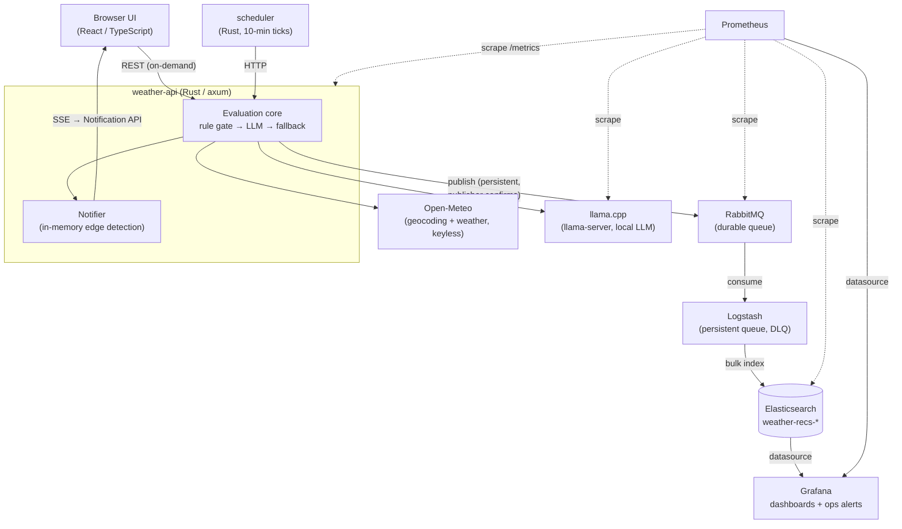
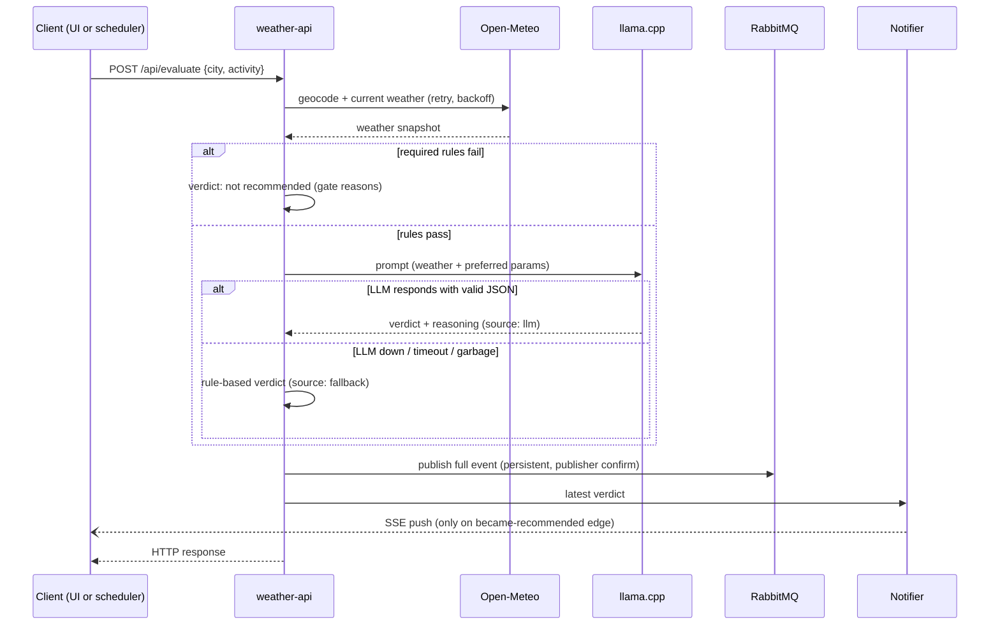

# what-da-weather — Design Document

> Weather-driven activity recommendation service. This document captures the full system design
> and, importantly, the reasoning behind every technical choice. It is the source of truth the
> implementation follows; the README covers how to run the system.

**Status:** approved design, pre-implementation
**Date:** 2026-08-26

---

## 1. Problem statement

Build a service that checks the weather in a chosen city (external weather API), asks a
**locally hosted, open-weights LLM** whether the weather suits a chosen activity, ships every
collected data point through a **queue service** (optionally via a processing service, e.g.
Logstash) into a **database**, exposes a **dashboard that alerts** when an activity is relevant,
and provides **monitoring and metrics for the entire infrastructure**. Everything must be
containerized, runnable simply and uniformly, and survive transient failures **without data
loss**. Deliverable: a git repository with code, configuration, CI/CD, and a README.

Bonuses: full test coverage, dedicated LLM observability metrics, automatic failure recovery.

## 2. Requirements digest (what the spec actually implies)

| # | Requirement | Non-obvious implication |
|---|---|---|
| R1 | Check weather for a chosen city via external API | Provider is our choice ("או אחר") |
| R2 | LLM recommendation, local, open weights, no external API | CPU-only inference inside Docker on macOS → small model |
| R3 | All collected data → queue → (processing) → database | The write path must flow **through the queue**, never app→DB directly |
| R4 | Dashboard that **alerts** when the activity is relevant | Alerting implies the system evaluates **continuously**, not only on user request → a scheduler is required |
| R5 | Monitoring + metrics for all infrastructure | Exporters for the broker and DB too, not just app metrics |
| R6 | Containerized, simple and uniform to run | Favors a keyless weather API and a single `docker compose up` |
| R7 | Transient failures without data loss | Durable queue, persistent messages, publisher confirms, ack-after-write, persistent queues in the processor, DLQ, volumes |
| R8 | Repo with code, config, CI/CD, README with reasoning | Every choice below carries its "why" |

## 3. Architecture overview



Two flows share the `weather-api` evaluation core:

1. **On-demand:** user picks a city (free text, geocoded) and one of the predefined activities
   in the UI → immediate evaluation → response rendered; the event is also published to the
   pipeline.
2. **Scheduled:** the `scheduler` binary ticks every 10 minutes over configured
   (city × activity) pairs — defaults: Tel Aviv, Haifa, Eilat × all activities — calling the
   same HTTP endpoint, so both paths exercise identical code.

### Evaluation core (per request)

1. Geocode city + fetch current weather from Open-Meteo (retry with backoff).
2. **Rule gate:** each activity defines **required** parameters (hard constraints — e.g. Matkot
   is impossible above a wind threshold or below a temperature floor). If a required constraint
   fails, the verdict is "not recommended" with the failed constraints as the reason; the LLM is
   not consulted.
3. **LLM ranking:** if required constraints pass, llama.cpp is prompted with the weather data
   and the activity's **preferred** parameters (soft preferences — e.g. Gaming is preferred in
   bad weather) and returns a structured JSON verdict + human-readable reasoning.
4. **Fallback:** if the LLM is unreachable/times out/returns garbage after bounded retries, a
   rule-based verdict from the preferred parameters is produced and flagged `source: "fallback"`
   (vs `source: "llm"`). The system degrades, never breaks.
5. The full event (city, weather snapshot, activity, gate results, verdict, source, latency)
   is published to RabbitMQ and returned to the caller.
6. The in-process **notifier** compares the verdict against its in-memory last-state map per
   (city, activity) and, on a **not-recommended → recommended transition only**, broadcasts an
   SSE event; open browser tabs surface it via the Notification API.



## 4. Activity model

Three predefined activities (strict — no free-text activities in v1):

| Activity | Required (hard gate) | Preferred (LLM ranking input) |
|---|---|---|
| Matkot at the beach | wind below threshold, temperature above floor, no heavy rain | warm, sunny, low humidity |
| Nature sightseeing | no dangerous conditions (storm, extreme heat) | mild temps, clear sky |
| Gaming (indoors) | none (always possible) | *bad* weather outside (storm, wind, extreme heat) — the inverse preference |

Rules live in a mounted **YAML file** (`config/activities.yaml`), deserialized at startup into
strict Rust types with `serde` — config-driven **and** compiler-validated: a malformed file
fails startup loudly. The scheduler's city list lives in the same file.

## 5. Decision ledger (choices, alternatives, and why)

### D1. Language: Rust (axum) for the backend
Compiler-driven development and strict typing make LLM-assisted iteration safer and regression
testing cheaper than a dynamic language. axum over actix-web: tokio/tower-native, frictionless
`/metrics` + SSE, current community default. One cargo workspace, **two binaries**
(`weather-api`, `scheduler`) sharing a lib crate — separate failure domains without code
duplication. Rust is the backend only; the frontend is TypeScript.

### D2. Orchestration: docker compose (only)
The spec's "simple and uniform to run" is best served by a single `docker compose up`.
Kubernetes manifests would demonstrate ops depth but raise the reviewer's cost to run.
Images are built k8s-ready (12-factor: env-var config, stateless services) should that change.

### D3. Weather provider: Open-Meteo (behind a provider trait)
OpenWeather (name-checked in the spec) requires the reviewer to register an API key before
anything runs; Open-Meteo is free and keyless, and the spec explicitly allows alternatives.
The provider sits behind a small Rust trait so OpenWeather can be slotted in via env config.

### D4. Pipeline: RabbitMQ → Logstash → Elasticsearch ("ELK, with RabbitMQ in front")
- **A processing consumer must exist:** RabbitMQ is a passive broker — nothing moves a message
  into a database unless something consumes it. The choice is *write* a consumer or *configure*
  one. Logstash is the configured, battle-tested option and is literally the component the
  assignment names. It earns its RAM: the `rabbitmq` input handles subscription/acks/reconnects,
  filters normalize documents (`@timestamp`, field types), and the `elasticsearch` output speaks
  the bulk API with retries and backpressure.
- **Why RabbitMQ, not Kafka:** our workload is a trickle (handfuls of small messages/minute)
  needing per-message ack, retry, dead-lettering, and per-message TTL — all RabbitMQ-native
  one-liners; in Kafka, DLQ/retry are hand-rolled patterns and a poison record head-of-line
  blocks its partition. Kafka's signature features (replay, partitioned throughput, many
  consumer groups with history bootstrap) go unused here: the full raw event is itself the
  document stored in ES, so "replayable history" already lives in the database. Kafka also costs
  ~1 GB+ of a 7.65 GB Docker VM. **Trigger to revisit:** if independent subscriber types
  multiply (rule of thumb: a handful+, or any consumer needing history bootstrap), the
  one-log/N-cursors model wins and the broker choice should be re-evaluated (RabbitMQ Streams
  being the on-ramp).
- **Why Elasticsearch as the DB:** natural fit for time-based JSON documents and the
  aggregation queries a dashboard needs; first-class Logstash output; Grafana datasource.

### D5. Dashboard: Grafana (no Kibana)
One tool covers business data (ES datasource) *and* infra metrics (Prometheus datasource), with
free alert rules. Kibana would add a second UI that only speaks ES, and its free tier lacks
webhook-class alert connectors. Grafana provisioning (datasources, dashboards, alert rules) is
committed as code.

### D6. User notifications: in-process, direct SSE push — **not** via Grafana, **not** via a queue
- An early design routed browser notifications through a Grafana alert webhook. Rejected after
  review: it turns an ops tool into a runtime dependency of the product's user flow, which
  inverts industry practice — monitoring alert stacks (Grafana/Alertmanager) notify *operators*;
  user-facing notifications are a product feature owned by the application.
- A second design used a dedicated notify queue (fanout exchange, TTL'd copy). Rejected as
  over-engineering: realtime nudges are worthless when late, so queue durability buys nothing.
  A missed notification is acceptable by design; Elasticsearch remains the durable record.
- Final: the notifier module inside `weather-api` (which already owns the SSE connections)
  keeps an in-memory last-verdict map per (city, activity) and pushes only on the
  **became-recommended edge**. Restart = silent re-baseline on the next cycle.
- **SSE + browser Notification API, not Web Push:** SSE (with `EventSource` auto-reconnect) is
  the standard transport for one-way, low-frequency notifications; Web Push would work with the
  tab closed but routes through Google/Mozilla relay servers — an external dependency that sits
  oddly next to the assignment's "local, no external API" spirit — and adds service-worker +
  VAPID key management. On reconnect/load the UI fetches a current-status snapshot
  (`/api/status`, backed by ES), so an open dashboard is never stale.

### D7. LLM runtime: llama.cpp (`llama-server`); model chosen empirically, configured by env
- Docker containers on macOS get **no GPU**, so CPU inference bounds model size.
- A hardware spike with `llmfit` (v0.9.33) against the Docker Desktop VM (7.65 GB RAM,
  10 CPUs; model budget ≈ 2.5 GB alongside ELK) shortlisted, all with ready GGUF quants:
  Llama-3.2-1B-Instruct (Q4_K_M ≈ 0.8 GB), **Qwen2.5-1.5B-Instruct (≈ 1.1 GB — leading
  candidate: best JSON-instruction adherence per size)**, Qwen3-1.7B (≈ 1.2 GB),
  gemma-3-1b-it (≈ 0.8 GB), Qwen2.5-3B-Instruct (≈ 2.1 GB, quality ceiling, borderline
  latency).
- Final selection is **deferred to live testing** during implementation; the model is an env
  var (`LLM_MODEL_URL`), the GGUF is downloaded on first start and cached in a named volume.
- The LLM is asked for strict JSON; parsing is defensive, with the D6 fallback on failure.

### D8. Frontend: React + TypeScript + Vite, served by axum
`vite build` emits static files; a multi-stage Dockerfile (node stage → rust stage → minimal
runtime) copies the `dist/` into the final image, served by axum (`tower-http` `ServeDir`).
Single origin → no CORS, trivial SSE. No Node at runtime, no separate nginx container.

### D9. Tests: unit tests first; integration deferred
Unit coverage for the rule engine, LLM-response parsing (valid / malformed / garbage → fallback),
weather-response parsing (mocked HTTP via `wiremock`), notifier edge detection; `vitest` for the
UI. A compose-based integration suite (including a "kill Logstash mid-stream, assert zero loss"
test) is a stretch goal if time allows.

### D10. CI/CD: GitHub Actions → GHCR
CI on every push/PR: `cargo fmt --check`, `cargo clippy -D warnings`, `cargo test`, frontend
`tsc` + `vitest`, `docker compose build`. CD on main: push images to GHCR. Build times are
controlled with GHA layer caching (`docker/build-push-action` `cache-from/to: gha`) and
`cargo-chef`, so Rust dependencies rebuild only when manifests change, not on every commit.

## 6. Reliability & no-data-loss design (R7)

Three layers, one per failure class:

1. **Producer → broker:** publisher confirms + bounded retry with backoff in `weather-api`;
   messages published persistent (`delivery_mode=2`) to a durable queue. RabbitMQ data on a
   named volume.
2. **Transient downstream outages:** Logstash persistent queue (`queue.type: persisted`, on a
   volume) absorbs ES outages; the ES output retries retryable errors (429/503) indefinitely;
   when the PQ fills, Logstash stops consuming and backlog accumulates safely in RabbitMQ —
   backpressure propagates cleanly end-to-end. Kill any single component mid-flight and the
   pipeline drains on recovery with zero loss.
3. **Poison messages:** Logstash's dead letter queue (ES-output rejections: mapping conflicts,
   HTTP 400/404) is enabled on a volume; a second Logstash pipeline (`dead_letter_queue` input)
   re-indexes DLQ entries into `weather-recs-dlq`, making poison messages visible in Grafana
   rather than silently parked. Since we control the producer, this index staying empty is
   itself a monitored signal.

**Automatic recovery (bonus):** every service has a healthcheck; `restart: unless-stopped`
everywhere; `depends_on: condition: service_healthy` ordering; LLM/weather outages degrade to
flagged fallback verdicts instead of errors.

**Accepted losses (deliberate):** browser notifications (realtime-only by design, D6) and
single-node disk failure (out of scope for a compose exercise; noted as the replication
boundary).

## 7. Observability (R5 + LLM bonus)

- **Prometheus scrapes:** `weather-api` and `scheduler` `/metrics`; RabbitMQ built-in
  prometheus plugin (queue depth, unacked, publish/deliver rates); `elasticsearch-exporter`;
  llama.cpp server metrics (`--metrics`).
- **Dedicated LLM metrics** (bonus): `llm_requests_total{status}`, `llm_errors_total{kind}`,
  `llm_latency_seconds` histogram, `llm_fallbacks_total`, tokens where available.
- **Business metrics:** evaluations per activity/city/verdict/source, notifier transitions.
- **Grafana (provisioned as code):** one business dashboard (current verdicts per city/activity,
  history from ES, DLQ count) and one infra dashboard (queue depth, PQ size, service health,
  LLM latency/error panels).
- **Ops-only alert rules** (D6): service down, queue depth growing without drain, LLM error
  rate, no-data-flowing (staleness), DLQ non-empty.

## 8. Repository layout (planned)

```
what-da-weather/
├── DESIGN.md                     # this document
├── README.md                     # how to run; architecture summary; links here for the "why"s
├── docker-compose.yml
├── .env.example                  # model URL, ports, credentials (defaults work out of the box)
├── config/
│   └── activities.yaml           # activity rules + scheduler cities
├── backend/                      # cargo workspace
│   ├── Cargo.toml
│   ├── crates/
│   │   ├── core/                 # shared lib: types, rules engine, providers, LLM client, publisher
│   │   ├── weather-api/          # axum binary: REST + SSE + static UI + /metrics
│   │   └── scheduler/            # tick binary
│   └── Dockerfile                # cargo-chef, multi-stage (also builds frontend dist)
├── frontend/                     # Vite + React + TS
├── logstash/
│   ├── pipeline/                 # main pipeline + dlq pipeline
│   └── logstash.yml              # persistent queue + DLQ settings
├── monitoring/
│   ├── prometheus/prometheus.yml
│   └── grafana/provisioning/     # datasources, dashboards, alert rules (as code)
└── .github/workflows/ci.yml
```

## 9. Deferred / open items

| Item | Status | Resolution path |
|---|---|---|
| Final LLM model | deferred (D7) | live latency/quality testing during implementation; env-configurable |
| Integration & failure-injection tests | stretch goal (D9) | compose-based suite; kill-container no-loss test |
| Free-text activities (LLM-only mode) | out of scope v1 | trivial to add: skip rule gate, flag `rules: none` |
| Web Push (tab-closed notifications) | out of scope v1 | documented upgrade path from SSE (D6) |
| Kubernetes manifests | out of scope (D2) | images are k8s-ready |
| Broker re-evaluation trigger | documented (D4) | revisit if independent subscriber types multiply |
