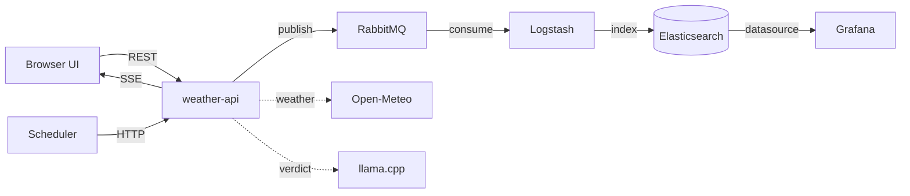

# what-da-weather 🌦️

Weather-driven activity recommendations. Pick a city and an activity (matkot at
the beach, nature sightseeing, or gaming indoors) and the system checks the
current weather, asks a **locally hosted LLM** whether it's a good idea, ships
every evaluation through a durable **RabbitMQ → Logstash → Elasticsearch**
pipeline, and pushes a browser notification the moment an activity *becomes*
recommended. A scheduler re-evaluates every configured city every 10 minutes,
and the whole stack is monitored with Prometheus + Grafana.

Full design rationale — every architectural choice and its alternatives — lives
in **[DESIGN.md](DESIGN.md)**. This README covers running and navigating the
system.

## Quick start

Requirements: Docker with ~6 GB of memory available to it. No API keys needed.

```bash
docker compose up -d --build
```

First boot downloads images and ~1.1 GB of LLM weights (cached in a volume
afterwards). Until the model is ready, verdicts transparently degrade to a
rule-based fallback — the system works immediately.

| URL | What | Credentials |
|---|---|---|
| http://localhost:8080 | The app (dashboard + API) | — |
| http://localhost:3000 | Grafana (business + infra dashboards, ops alerts) | admin / admin |
| http://localhost:9090 | Prometheus | — |
| http://localhost:15672 | RabbitMQ management | weather / weather |

Configuration is optional: copy `.env.example` to `.env` to change the LLM
model, ports, or credentials. Activity rules and scheduler cities live in
[config/activities.yaml](config/activities.yaml).

## Architecture



**How an evaluation works** (both the UI and the scheduler hit the same
`POST /api/evaluate`):

1. **Weather** — the city is geocoded and current conditions fetched from
   Open-Meteo (keyless, chosen so the project runs with zero setup; the
   provider sits behind a Rust trait so OpenWeather can be slotted in).
2. **Hard gate** — each activity's *required* constraints (e.g. matkot is
   impossible in >25 km/h wind). Any violation → "not recommended", with the
   violated constraints as the reason. The LLM is not consulted.
3. **LLM verdict** — if the gate passes, llama.cpp (an open-weights model
   running fully locally, CPU-only) ranks the *preferred* conditions and
   returns strict JSON: `{recommended, reasoning}`.
4. **Fallback** — if the LLM is down, slow, or returns garbage, a rule-based
   verdict from the preferred conditions is served instead, flagged
   `source: "fallback"`. The system degrades, never breaks.
5. **Persist** — the full event is published to RabbitMQ (persistent message,
   durable queue, publisher confirm), consumed by Logstash, and indexed into
   a daily Elasticsearch index. The app never writes to the database directly.
6. **Notify** — the in-process notifier tracks the last verdict per
   (city, activity) and pushes an SSE event **only on the
   not-recommended → recommended transition**; open browser tabs surface it
   via the Notification API.

### Reliability: transient failures without data loss

Three layers, one per failure class (details in DESIGN.md §6):

- **Producer → broker**: publisher confirms + bounded retry; persistent
  messages on a durable queue backed by a volume.
- **Downstream outages**: Logstash's *persistent queue* absorbs Elasticsearch
  downtime; when it fills, backpressure propagates and backlog accumulates
  safely in RabbitMQ. Kill any single component mid-stream and the pipeline
  drains on recovery with zero loss (idempotent document ids make redelivery
  exactly-once in storage).
- **Poison messages**: Logstash's dead-letter queue captures ES rejections; a
  second pipeline re-indexes them into `weather-recs-dlq`, which is graphed
  and alerted on — an empty DLQ is itself a monitored signal.

Every container has a healthcheck, `restart: unless-stopped`, and
health-ordered startup — recovery from crashes is automatic.

### Observability

Prometheus scrapes all five components (API, scheduler, RabbitMQ via its
built-in prometheus plugin, Elasticsearch via exporter, llama.cpp via
`--metrics`). Grafana is provisioned as code with two dashboards:

- **Weather Recommendations** — evaluations and verdicts over time (from
  Elasticsearch), verdict sources, notification count, DLQ size.
- **Infrastructure & LLM** — service health, queue depth, throughput, and the
  dedicated LLM metrics: `llm_requests_total{status}`, `llm_errors_total{kind}`,
  `llm_latency_seconds` histogram, `llm_fallbacks_total`.

Ops alert rules (service down, queue backlog, LLM error rate, DLQ non-empty,
data-flow staleness) are provisioned too. They alert *operators*; user-facing
notifications are a product feature inside the app, deliberately not routed
through the monitoring stack (DESIGN.md D6).

## Repository layout

```
├── DESIGN.md                # the "why" behind every choice
├── docker-compose.yml       # the whole system
├── config/activities.yaml   # activity rules + scheduler cities (validated at startup)
├── backend/                 # Rust workspace: core lib + weather-api + scheduler
├── frontend/                # React + TypeScript (Vite), served by weather-api
├── logstash/                # main + DLQ pipelines, persistent queue config
├── monitoring/              # Prometheus config, Grafana provisioning (as code)
└── .github/workflows/ci.yml # fmt/clippy/tests + image build, GHCR push on main
```

## Development

```bash
# Backend (Rust 1.93+): format, lint, test
cd backend && cargo fmt && cargo clippy --workspace --all-targets && cargo test

# Frontend (Node 22+): dev server proxies /api to localhost:8080
cd frontend && npm install && npm run dev
npm test && npm run build
```

CI runs the same checks on every push/PR; merges to `main` additionally push
the image to GHCR with GitHub Actions layer caching + cargo-chef so Rust
dependencies rebuild only when manifests change.

## API

| Endpoint | Description |
|---|---|
| `POST /api/evaluate` | `{"city": "Tel Aviv", "activity": "matkot"}` → full evaluation event + whether it was durably published |
| `GET /api/status` | Latest verdict per (city, activity) — Elasticsearch merged with in-memory state |
| `GET /api/activities` | Configured activities and scheduler cities |
| `GET /api/events` | SSE stream of became-recommended notifications |
| `GET /metrics` | Prometheus metrics |
| `GET /healthz` | Liveness |
