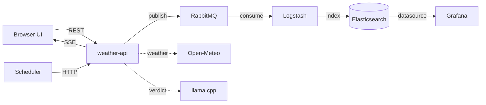

# what-da-weather 🌦️

Weather-driven activity recommendations. Pick a city and an activity (matkot at
the beach, nature sightseeing, or gaming indoors) and the system checks the
current weather, asks a **locally hosted LLM** whether it's a good idea, ships
every evaluation through a durable **RabbitMQ → Logstash → Elasticsearch**
pipeline, and pushes a browser notification the moment an activity *becomes*
recommended. A scheduler re-evaluates every configured city every minute
(configurable via `SCHEDULER_INTERVAL_MINUTES` or `config/activities.yaml`),
and the whole stack is monitored with Prometheus + Grafana.

Full design rationale — every architectural choice and its alternatives — lives
in **[DESIGN.md](DESIGN.md)**. This README covers running and navigating the
system.

## Quick start

Requirements: Docker with ~6 GB of memory available to it. No API keys needed.

```bash
docker compose up -d
```

First boot downloads images and ~1.1 GB of LLM weights (cached in a volume
afterwards). Until the model is ready, verdicts transparently degrade to a
rule-based fallback — the system works immediately.

| URL | What | Credentials |
|---|---|---|
| http://localhost:8080 | The app (dashboard + API) | — |
| http://localhost:3000 | Grafana (business + infra dashboards, ops alerts) | admin / admin |
| http://localhost:9090 | Prometheus | — |
| http://localhost:15672 | RabbitMQ management | weather / weather |

Configuration is optional: copy `.env.example` to `.env` to change the LLM
model, ports, or credentials. Activity rules and scheduler cities live in
[config/activities.yaml](config/activities.yaml).

## Architecture



**How an evaluation works** (both the UI and the scheduler hit the same
`POST /api/evaluate`):

1. **Weather** — the city is geocoded and current conditions fetched from
   Open-Meteo (keyless, chosen so the project runs with zero setup; the
   provider sits behind a Rust trait so OpenWeather can be slotted in).
2. **Hard gate** — each activity's *required* constraints (e.g. matkot is
   impossible in >25 km/h wind). Any violation → "not recommended", with the
   violated constraints as the reason. The LLM is not consulted.
3. **LLM verdict** — if the gate passes, llama.cpp (an open-weights model
   running fully locally, CPU-only) ranks the *preferred* conditions and
   returns strict JSON: `{recommended, reasoning}`.
4. **Fallback** — if the LLM is down, slow, or returns garbage, a rule-based
   verdict from the preferred conditions is served instead, flagged
   `source: "fallback"`. The system degrades, never breaks.
5. **Persist** — the full event is published to RabbitMQ (persistent message,
   durable queue, publisher confirm), consumed by Logstash, and indexed into
   a daily Elasticsearch index. The app never writes to the database directly.
6. **Notify** — the in-process notifier tracks the last verdict per
   (city, activity) and pushes an SSE event **only on the
   not-recommended → recommended transition**; open browser tabs surface it
   via the Notification API.

### Reliability: transient failures without data loss

Three layers, one per failure class (details in DESIGN.md §6):

- **Producer → broker**: publisher confirms + bounded retry; persistent
  messages on a durable queue backed by a volume.
- **Downstream outages**: Logstash's *persistent queue* absorbs Elasticsearch
  downtime; when it fills, backpressure propagates and backlog accumulates
  safely in RabbitMQ. Kill any single component mid-stream and the pipeline
  drains on recovery with zero loss (idempotent document ids make redelivery
  exactly-once in storage).
- **Poison messages**: Logstash's dead-letter queue captures ES rejections; a
  second pipeline re-indexes them into `weather-recs-dlq`, which is graphed
  and alerted on — an empty DLQ is itself a monitored signal.

Every container has a healthcheck, `restart: unless-stopped`, and
health-ordered startup — recovery from crashes is automatic.

### Observability

Prometheus scrapes all five components (API, scheduler, RabbitMQ via its
built-in prometheus plugin, Elasticsearch via exporter, llama.cpp via
`--metrics`). Grafana is provisioned as code with two dashboards:

- **Weather Recommendations** — evaluations and verdicts over time (from
  Elasticsearch), verdict sources, notification count, DLQ size.
- **Infrastructure & LLM** — service health, queue depth, throughput, and the
  dedicated LLM metrics: `llm_requests_total{status}`, `llm_errors_total{kind}`,
  `llm_latency_seconds` histogram, `llm_fallbacks_total`.

Ops alert rules (service down, queue backlog, LLM error rate, DLQ non-empty,
data-flow staleness) are provisioned too. They alert *operators*; user-facing
notifications are a product feature inside the app, deliberately not routed
through the monitoring stack (DESIGN.md D6).

## Repository layout

```
├── DESIGN.md                # the "why" behind every choice
├── docker-compose.yml       # the whole system
├── config/activities.yaml   # activity rules + scheduler cities (validated at startup)
├── backend/                 # Rust workspace: core lib + weather-api + scheduler
├── frontend/                # React + TypeScript (Vite), served by weather-api
├── logstash/                # main + DLQ pipelines, persistent queue config
├── monitoring/              # Prometheus config, Grafana provisioning (as code)
└── .github/workflows/ci.yml # fmt/clippy/tests + image build, GHCR push on main
```

## Development

```bash
# Backend (Rust 1.93+): format, lint, test
cd backend && cargo fmt && cargo clippy --workspace --all-targets && cargo test

# Frontend (Node 22+): dev server proxies /api to localhost:8080
cd frontend && npm install && npm run dev
npm test && npm run build

# Run the full stack from the local tree instead of the released GHCR image
docker build -t what-da-weather:local -f backend/Dockerfile .
APP_IMAGE=what-da-weather:local docker compose up -d
```

CI runs the same checks on every push/PR; merges to `main` additionally push
the image to GHCR with GitHub Actions layer caching + cargo-chef so Rust
dependencies rebuild only when manifests change.

## API

| Endpoint | Description |
|---|---|
| `POST /api/evaluate` | `{"city": "Tel Aviv", "activity": "matkot"}` → full evaluation event + whether it was durably published |
| `POST /api/debug/evaluate` | `{"activity": ..., "weather": {...}}` — synthetic weather through the identical gate → LLM path; returns the verdict **and the exact prompt sent**. Nothing published or notified. Drives the UI's 🛠 Debug view (sliders per parameter) |
| `GET /api/status` | Latest verdict per (city, activity) — Elasticsearch merged with in-memory state |
| `GET /api/activities` | Configured activities and scheduler cities |
| `GET /api/events` | SSE stream of became-recommended notifications |
| `GET /metrics` | Prometheus metrics |
| `GET /healthz` | Liveness |

## FAQ

**Q1. Why Non-relational DB? Why ES?**

We are manipulating doc-like events over a time series (weather + verdict at 10AM) that never mutate — write once, no edits backwards, no Join/Union. That's exactly what ES is good at: aggregating documents over time buckets, and it's natively supported by Logstash & Grafana. Small bonus: event_id is also the ES document id, so a redelivered message just overwrites itself (idempotent, no dupes).

A relational DB here would introduce schema migrations without really any benefit — we don't use anything relational.

(Also the assignment literally names Logstash — so ELK-shaped pipeline is the configured, battle-tested path instead of writing my own consumer.)

**Q2. Why queue and not event streaming?**

Our architecture is a single queue fed into a single consumer:

```
Backend -> Queue -> Logstash -> Elasticsearch
```

Event streaming like Kafka shines in one-to-many publishing (one source of truth published to multiple microservices, i.e. SaaS customer onboarding/offboarding) — we have one consumer. And because all the data lands in ES anyway, there is no real use case for replayability (the other big Kafka advantage) — the "replayable history" already lives in the DB.

What RabbitMQ gives us for free: per-message ack, retry, TTL and dead-lettering as native one-liners (in Kafka these are hand-rolled patterns, and a poison record blocks its whole partition). Plus a much lower memory footprint — Kafka costs ~1GB+ out of a 7.65GB Docker VM.

When to revisit: if independent consumer types multiply, one-log/many-cursors wins — at that point we migrate to Kafka.

**Q3. Why Rust?**

Rust is compiled and memory safe with strict types by default, which allows compiler-driven design with LLM — the compiler kills whole classes of bugs (types, ownership, null) before review, so what's left for me and the tests is just logic. This makes it easy to offload development to an LLM: if it compiles, a whole category of bugs is already gone — the tests cover the rest. ([talk from AI Engineer conference](https://www.youtube.com/watch?v=ugUeZ8-b-u0&t=842s))

axum over actix — tokio/tower native, /metrics and SSE with no friction. One workspace, two binaries (api + scheduler) sharing a lib crate — separate failure domains, no code duplication.

**Q4. Why TypeScript?**

All of the Rust points above — although softer than Rust. tsc runs in CI, so if the backend API shape drifts, the build fails, not the demo.

**Q5. Why is alerting logic in the backend?**

Our "product" sends real-time alerts which have no value outside a 5-10 minute window, and currently we have only one interface (website).

Based on that, nothing stores the alerts at all — the backend keeps in memory only the last verdict per (city, activity), just to detect the not-recommended -> recommended edge, then pushes SSE. A missed notification is acceptable by design — ES stays the durable record.

Two designs I rejected on the way: alerting through a Grafana webhook (turns an ops tool into a runtime dependency of the product — monitoring alerts operators, user notifications are a product feature), and a dedicated notify queue (durability buys nothing for an alert that's worthless 10 minutes later).

If the use case arises (mobile app, email, alert history) — that's the trigger to build a proper notification pipeline. For our small app I went with simplicity (KISS principle).

**Q6. Why choose LLM "X"?**

Empirically, in rounds.

*Sizing the hardware envelope:* I used llmfit to determine what can run in my Docker Desktop VM (7.65GB RAM, 10 CPUs, no GPU — ~2.5GB model budget next to ELK) — that shortlists 1-3B models with ready GGUF quants.

*What I actually need from the model:* No novel capabilities (tool use etc.) — just fast e2e CPU inference and structured output (JSON).

*Eval at scale via OpenRouter:* Instead of downloading every candidate and testing serially on my laptop, I ran the exact production prompts (same system prompt, same request shape) against all in-budget candidates in parallel through OpenRouter — hours of local testing compressed into minutes. Ministral-3-3B was the only in-budget model to go 9/9 (incumbent baseline was 8/9). Caveat I kept in mind: OpenRouter serves full-precision weights, so cloud scores are an upper bound — the final Q4 quant was re-validated locally through the debug page before adoption.

*Live testing rounds:*

- Qwen2.5-1.5B — passed JSON + latency but failed prompt eval testing (reasoning contradicted its own verdict) — out.
- Qwen2.5-3B — 9/9 on my probe matrix, but needed several rounds of prompt scaffolding.
- Ministral-3-3B — passed the same matrix without scaffolding tuned for it, better reasoning — adopted.

*The agency discovery:* Ministral occasionally deviated from strict guidance — e.g. recommending sightseeing at 6km visibility because the other conditions held, explicitly citing the trade-off. I judged that a feature, not a bug: sound, cited judgment on marginal cases is exactly what I hired an LLM for (a rules engine could do blind obedience). So I softened the guidance from hard rules to norms ("should normally") and let the model own the judgment call — code still guarantees the facts and the hard gate.

*The deeper decision:* The LLM never does arithmetic — a 3B model demonstrably can't (measured: it misses "18 > 12") — so code computes every condition and the model judges pre-computed facts.

*Swappability:* The model itself is an env var — swapping is config, not a rebuild.

**Q7. Why Grafana and not Kibana?**

Grafana is the industry standard for infra observability, and it also queries Elasticsearch — the opposite is not true (Kibana only fronts ES, it can't read Prometheus, so infra metrics would need a second tool). Free-tier Kibana also lacks webhook-class alert connectors. "Why not add both?" — single house for all queries, provisioned as code (datasources, dashboards, alert rules committed in the repo) — simpler and more manageable.
